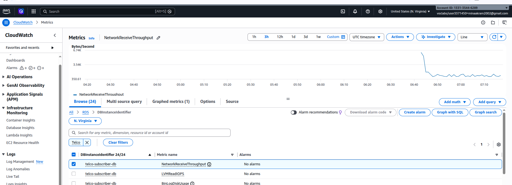

# 🌐 Telco Cloud: High-Availability Subscriber Management

## 📋 Project Overview
This project demonstrates a robust **3-Tier Cloud Architecture** designed for Telecommunications Service Providers. It features a **Virtual Network Function (VNF)** integrated with **Auto Scaling** to ensure the Subscriber Management Portal remains available under any traffic load.

---

## 🏗️ Architecture Design
The infrastructure is built within a custom **VPC** to provide maximum security and logical isolation:

* **Public Tier:** Hosts the EC2 Web Servers (Portal) across multiple instances.
* **Private Tier:** Hosts the Amazon RDS (MySQL) database, isolated from public access.
* **Elasticity:** An **Auto Scaling Group (ASG)** monitors demand and adjusts the number of servers automatically.

### 🗺️ Infrastructure Resource Map

*Detailed visual of the VPC, Subnets, and Gateways.*

---

## 🚀 Key Features & Implementation

### 1. Auto Scaling & High Availability
The system is configured to maintain a **Desired Capacity of 2 instances**, with the ability to scale up to 3 based on CPU demand.
%20.png)
*Evidence of 3 running instances managed by the ASG.*

*Auto Scaling Group status showing "Updating capacity" and successful launch.*

### 2. VNF User Interface
The portal provides real-time database connectivity status and subscriber management tools.

*The front-end interface of the Telecom Service Management.*

### 3. Real-time Monitoring
Integrated with **Amazon CloudWatch** to track system health and CPU utilization.

*Visualizing performance data.*

---

## 📁 Repository Structure
* `index.php`: The main portal logic for subscriber management.
* `config.php`: Secure database connection configuration.
* `ec2 server.png`: Initial server deployment proof.

---

## 🛠️ Tech Stack
* **Cloud Provider:** AWS (VPC, EC2, RDS, ASG, CloudWatch)
* **Backend:** PHP 8.x
* **Database:** MySQL (Amazon RDS)
* **Web Server:** Apache (httpd)
