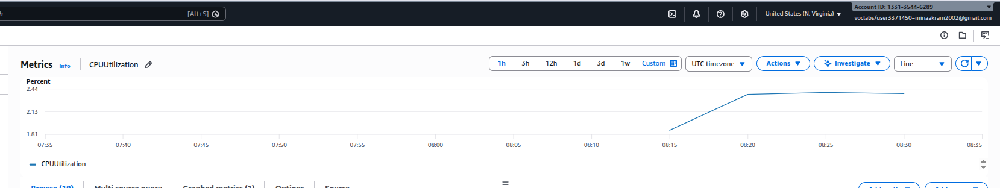

# 🌐 Telco Cloud: High-Availability Subscriber Management

## 📋 Project Overview

This project demonstrates a robust **3-Tier Cloud Architecture** designed for Telecommunications Service Providers.  

It simulates a **Virtual Network Function (VNF)** integrated with **Auto Scaling**, ensuring that the Subscriber Management Portal remains highly available under fluctuating traffic loads.

The implementation focuses on High Availability, Elasticity, Security, and Observability using AWS core services.

---

## 🏗️ Architecture Design

The infrastructure is deployed inside a custom **Amazon VPC** to ensure strong isolation and secure network segmentation.

### 🔹 Public Tier
- Application Load Balancer (ALB)
- Internet Gateway  
Handles and distributes incoming traffic across application instances.

### 🔹 Private Tier (Application Layer)
- EC2 Web Servers (Amazon Linux 2023)
- Managed by an Auto Scaling Group (ASG)

The application layer dynamically scales based on CPU utilization.

### 🔹 Private Tier (Data Layer)
- Amazon RDS (MySQL)
- No public access
- Secured within private subnets

### 🔹 Elasticity Strategy
- Desired Capacity: 2 instances
- Maximum Capacity: 3 instances
- Scaling Metric: CPUUtilization

---

## 🗺️ Infrastructure Resource Map


*Detailed visualization of the VPC, subnets, routing, and gateways.*

---

## 🖥️ Application Deployment (EC2 Configuration)

The VNF portal was deployed on **Amazon Linux 2023** instances.

Using SSH access, the following components were configured:

- Apache (httpd)
- PHP 8.x
- Secure RDS database connection
- Portal logic inside `/var/www/html/`


*Manual configuration and deployment of the VNF portal.*

---

## 🚀 Key Features & Implementation

### 1️⃣ Auto Scaling & High Availability

The Auto Scaling Group maintains a minimum of two instances and scales up automatically during peak CPU usage.

%20.png)

*Three running EC2 instances during peak load.*


*Auto Scaling Group configuration and capacity management.*

---

### 2️⃣ VNF User Interface

The portal simulates a telecom subscriber management dashboard.

Features:
- Real-time database connection status
- Subscriber data simulation
- Telecom-style interface


---

### 3️⃣ Real-time Monitoring (Observability)

Integrated with **Amazon CloudWatch** to monitor:

- CPU Utilization
- Instance health
- Scaling activity

CPUUtilization was used as the primary scaling trigger.



---

## 📁 Repository Structure

```bash
AWS-Telco-Cloud-Infrastructure/
│
├── README.md
├── index.php
├── config.php
│
├── Resourse map.png
├── ec2 server.png
├── Instances (3) .png
├── Auto Scaling groups.png
├── VNF Interface.png
└── cloudwatch.png
```
