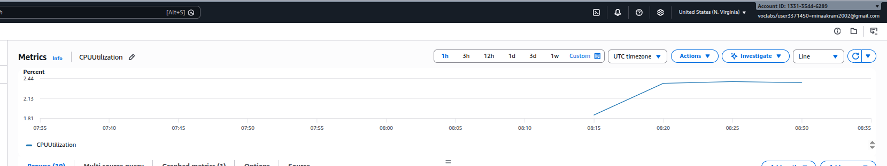

# High-Availability Telco Cloud: Subscriber Management Infrastructure

## Overview
This project implements a **3-Tier Cloud Architecture** tailored for Telecommunications Service Providers. It simulates a **Virtual Network Function (VNF)** environment, leveraging AWS managed services to ensure high availability, fault tolerance, and automated scalability for subscriber management operations.

## Architecture Design & Network Segmentation
The infrastructure is deployed within a custom **Amazon VPC** to enforce strict network isolation and security.

### Tiered Infrastructure:
* **Presentation Layer (Public Subnets):** Application Load Balancer (ALB) integrated with an Internet Gateway for intelligent traffic distribution.
* **Application Layer (Private Subnets):** Decoupled EC2 instances running Amazon Linux 2023, managed by an Auto Scaling Group (ASG) to handle dynamic VNF workloads.
* **Data Layer (Isolated Subnets):** Amazon RDS (MySQL) instances with no public ingress, ensuring database integrity and security.

## Infrastructure Resource Map

*VPC Visualization: Illustrating routing tables, subnetting, and gateway configurations.*

## Deployment & Configuration
The VNF application was deployed on **Amazon Linux 2023** via SSH. The stack includes:
* **Web Server:** Apache (httpd)
* **Runtime:** PHP 8.x
* **Database Integration:** Secure RDS connectivity with encrypted credential management.

## Elasticity & High Availability Strategy
To maintain service continuity under fluctuating subscriber traffic, the following scaling policies were implemented:
* **Scaling Metric:** Target tracking based on `CPUUtilization`.
* **Fleet Management:** ASG configured with a desired capacity of 2 and a maximum of 3 instances.
* **Health Checks:** ALB-based health checks to ensure traffic is only routed to healthy VNF nodes.

### Scaling & Instance Status
%20.png)
*Active EC2 fleet scaling during peak load conditions.*

*Auto Scaling Group policy definition and capacity lifecycle.*

## VNF User Interface
The portal simulates a production-grade Telecom Subscriber Management dashboard, featuring real-time database connectivity status and subscriber data modeling.

## Observability & Monitoring
Utilized **Amazon CloudWatch** for real-time telemetry and monitoring of:
* System-level metrics (CPU, Memory, Disk I/O).
* ASG scaling activities and alarm triggers.
* Application Load Balancer request latency.

## Repository Structure
* `/app`: PHP source code for the VNF portal.
* `/assets`: Infrastructure diagrams and deployment screenshots.
